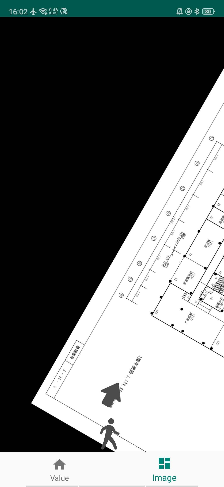
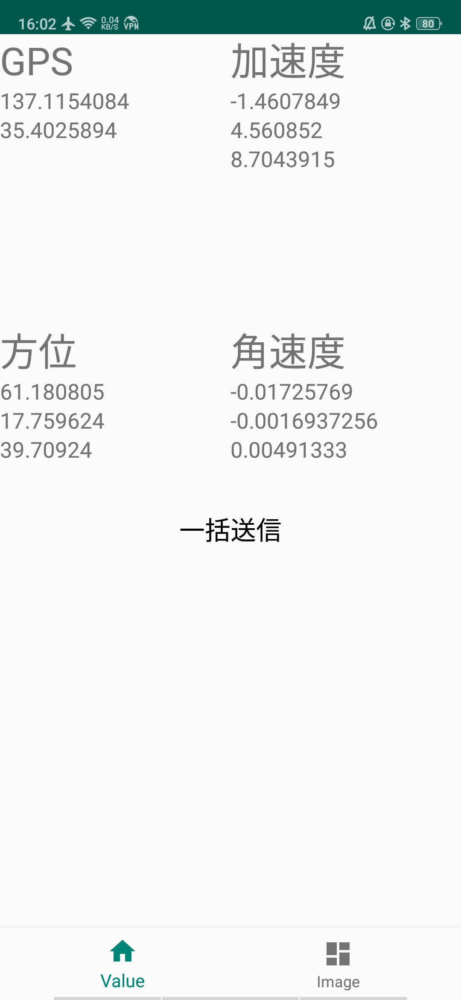

# 避難経路&センサー取得アプリ
## 使い方
- 避難誘導画面とセンサー画面を下タブで切り替えることができます

| 避難誘導画面 | センサー画面 |
| ------ | ------ |
|  |  |

### 避難誘導画面
- 取得したセンサー情報を元にAPIを叩き、サーバーから返されたレスポンス画像等を加工して表示します

### センサー画面
- 取得可能なセンサーの現在の値を表示しています
- 画面中央部の「一括送信」ボタンでアプリ内DBに保存しているセンサーデータをサーバーへ送信することができます

## プログラム説明
### 画面での画像表示
- [app/src/main/java/take/dic/sensorapp/fragment/image/MyImage.kt](app/src/main/java/take/dic/sensorapp/fragment/image/MyImage.kt) の`loadHogeImage`メソッドに記述されています (Hoge: Avatar, Bottom, Direction)
    - [app/src/main/java/take/dic/sensorapp/api/controller/ApiController.kt](app/src/main/java/take/dic/sensorapp/api/controller/ApiController.kt) 内の`OnFailure`等 (詳しくはコメントで記載) にAPIがエラーをした場合の処理を書くことができます

### センサー取得方法
- *app/src/main/java/take/dic/sensorapp/sensorvalue/* 内にセンサ値取得用のモデルがあります
    -  *beacon*
        -  ビーコン
    -  *motion*
        -  加速度, 角速度, 方位
    -  [GPSValue.kt](app/src/main/java/take/dic/sensorapp/sensorvalue/GPSValue.kt)
        -  GPS
- *app/src/main/java/take/dic/sensorapp/fragment/value/* 内の`HogeFragment.kt`に実際に値を取得する処理を記述しています (Hoge: Acceleration, Direction, Gyro, Beacon, GPS)

### APIの定義
- *app/src/main/java/take/dic/sensorapp/api/model/* 内の各プログラム